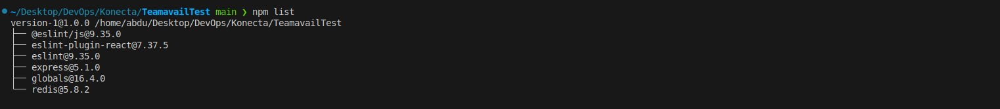
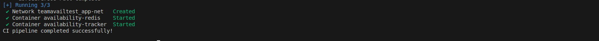
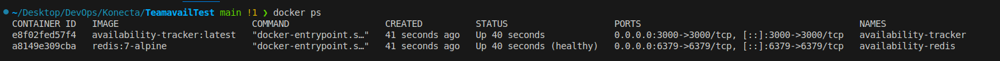
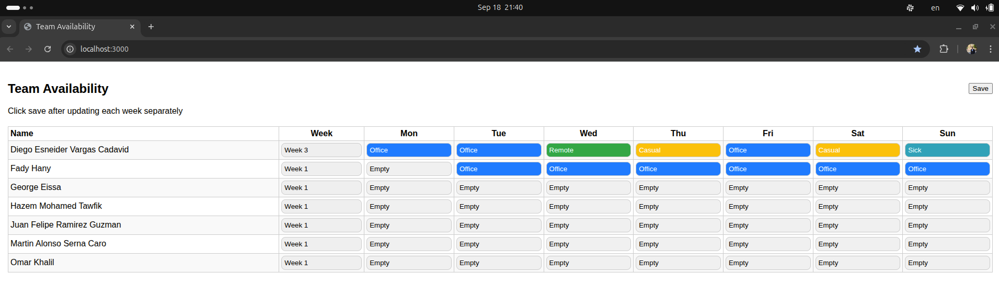
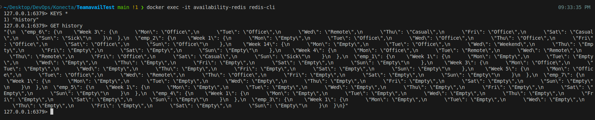
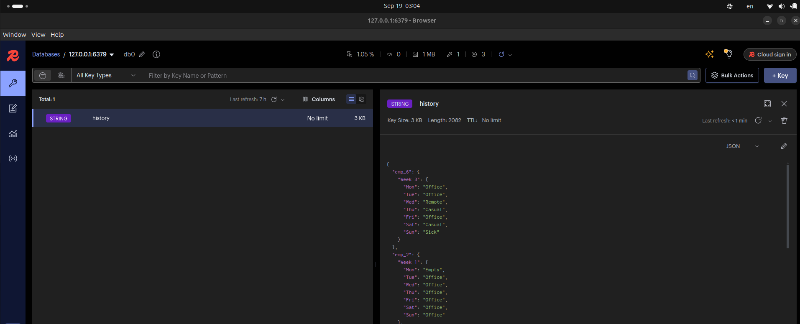
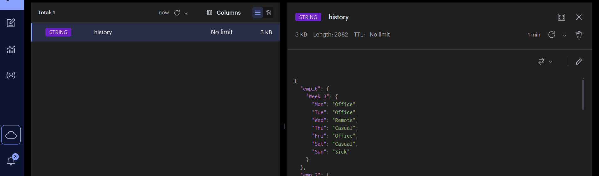

# Project: Building a CI/CD Pipeline for the Availability Tracker

## Project Overview

*This project implements a CI/CD pipeline for the Availability Tracker
 app.
The app is a Node.js service that tracks team availability. The pipeline automates linting, testing, containerization, and deployment using Docker and Bash scripting.*

*The project also includes optional extensions with GitHub Actions, Jenkins, and Terraform for simulating infrastructure.*


## Project Tasks (Stage-one)

### 1. **Set Up the Project**

#### 1.1 Clone the project repository.
```bash
git clone https://github.com/ge0rgeK/TeamavailTest.git
cd TeamavailTest
```

#### 1.2 Create a [`.gitinore`](.gitignore).
```bash
# Node.js dependencies
node_modules/

# Logs
npm-debug.log*
yarn-error.log*
*.log

# System files
.DS_Store

# Docker environment overrides
.env
```

#### 1.3 Install the required dependencies locally.
```bash
npm install
npm list    # This shows all installed packages
```


---

### 2. **Write a Bash Script (`ci.sh`)**
- This script:
   -  Run code formatting and linting.
   -  Run tests.
   -  Build a Docker image of the application.
   -  Start the application using Docker Compose.
  
[`ci.sh`](ci.sh)
```bash
#!/bin/bash

set -euo pipefail

APP_NAME="availability-tracker"
TAG="latest"

echo "Running lint checks..."
if ! npx eslint .; then
  echo "ESLint issues found!"
fi

if ! npx prettier --check .; then
  echo "Prettier formatting issues found!"
fi

echo "Running tests..."
if npm run | grep -q "test"; then 
  npm install
  npm test
else
  echo "No test script found!!"
fi 


echo " Building Docker image..."
docker build \
  --cache-from=$APP_NAME:$TAG \
  -t $APP_NAME:$TAG .


echo "Starting application with Docker Compose..."

docker compose down || true
docker compose up -d --build 

echo "CI pipeline completed successfully!"
```
---

### 3. **Dockerize the App**
* Containerizes the Node.js app.

* Uses Node 18 slim for smaller image size.

* Runs server.js as the entrypoint.

[`Dockerfile`](Dockerfile)
```bash
# slim Node.js image
FROM node:18-slim

# Set working directory 
WORKDIR /app

# Copy package files first for caching
COPY package*.json ./

# Install dependencies
RUN npm install --production


# Copy rest of the app 
COPY . .

# Expose the app port
EXPOSE 3000


# Run the app
CMD [ "node", "server.js" ]
```
---

### 4. **Use Docker Compose**
   -  Create a `docker-compose.yml` file.
   -  Include the app and any required services like Redis
   -  Configure volumes and ports properly.

[`docker-compose.yml`](docker-compose.yml)
```bash
version: "3.9"

services:
  app:
    image: availability-tracker:latest   # built in ci.sh
    container_name: availability-tracker
    restart: unless-stopped
    ports:
      - "3000:3000"
    environment:
      - NODE_ENV=production
      - REDIS_URL=redis://availability-redis:6379   # matches server.js
    depends_on:
      - redis
    volumes:
      - ./output:/app/output   # persist history.json
    networks:
      - app-net

  redis:
    image: redis:7-alpine
    container_name: availability-redis
    restart: unless-stopped
    ports:
      - "6379:6379"
    volumes:
      - redis-data:/data      # persist Redis data
    networks:
      - app-net
    healthcheck:              # optional, ensures app waits for Redis
      test: ["CMD", "redis-cli", "ping"]
      interval: 10s
      timeout: 5s
      retries: 5

volumes:
  redis-data:

networks:
  app-net:
    driver: bridge
```
---

### 5. **Verification**

#### 5.1 Run your full pipeline locally to ensure it works.

* Make the [`ci.sh`](ci.sh) script executable:
    ```bash
    chmod +x ci.sh
    ./ci.sh
    ```
    


* **Confirm containers are running**
  


* **Test the app in browser: `http://localhost:3000`**
  

* **Check Redis data:**
  

---

## Issues and Troubleshooting (Stage01)

### 1. Redis Module Not Found
 
* **What Happened:**
  - When trying to require Redis in server.js (const redis = require('redis');), Node.js threw:

* **Cause:**
  - The Redis client library wasn’t installed in the project. The repo didn’t include it in package.json

* **Solution:**
  - Installed the Redis module with:
  ```bash
  npm install redis
  ```

---

### 2. Redis Client Error (ClientClosedError)

* **What Happened:**
  - After installing Redis, running client.set(...) caused:
  ```bash
  Uncaught ClientClosedError: The client is closed
  ```
* **Cause:**
  - Redis v5+ requires explicitly calling .connect() before using commands. The client was being used without a proper connection.

* **Solution:**
  - Updated server.js to connect first:
  ```bash
  const client = redis.createClient({
    url: 'redis://availability-redis:6379'
    });

  # Connect to Redis
  client.connect()
    .then(() => console.log('Redis connected!'))
    .catch((err) => console.error('Redis connection error:', err));
  ```
---

### 3. Large JSON Output in Redis CLI

* **What Happened:**
  
  - Running GET history in redis-cli returned a large JSON object as an escaped string, which was very hard to read.
  

* **Cause:**
  - Redis CLI doesn’t format JSON output.

* **Solution:**
  - Installed RedisInsight to visualize data:
  
* **Installed with:**
  ```bash
  sudo dpkg -i redisinsight-linux64.deb
  sudo apt --fix-broken install
  ```
* **Connected to Redis at localhost:6379.**

* **Viewed the history key in pretty JSON/tree format.**

####  **Verification**


---


## Project – Stage 2: AWS ECS CI/CD with Terraform & Jenkins


### Stage 2 Overview

*This project demonstrates a CI/CD pipeline that deploys a Node.js + Redis application on AWS ECS Fargate, using Terraform for infrastructure as code and Jenkins for automation.*

**In Stage 1, the app (Node.js + Redis) was tested locally using Docker Compose.**

**In Stage 2, we move the project to the cloud with a production-grade CI/CD pipeline:**

* Terraform provisions AWS infrastructure.

* Jenkins automates build, test, image push, and deployment.

* The app runs on ECS Fargate, with ALB for routing, Redis (ElastiCache) for storage, and ECR for container images.
---


## 1. Terraform Setup (Infrastructure as Code)

*In this stage, we use Terraform to provision all the AWS infrastructure required for our app.*
*Instead of writing everything in one big main.tf, we follow best practice by using **modules**.*

### Why Use Modules?
Terraform modules allow us to organize infrastructure code into reusable units.

* Each module represents one infrastructure component (VPC, ECS, Redis, ALB, etc.).

* This makes the code cleaner, easier to maintain, and reusable across projects.

---
### 1.1. Backend Configuration

I configure Terraform to store state in S3 with a DynamoDB lock table for safety.

**[`backend.tf`](./terraform-ecs/backend.tf)**

```bash
terraform {
  backend "s3" {
    bucket         = "availability-tracker"
    key            = "ecs/terraform.tfstate"
    region         = "eu-central-1"
    dynamodb_table = "tf-locks"
    encrypt        = true
  }
}
```
**Why?**
- S3 ensures state is persistent and shared across team members.

- DynamoDB lock prevents multiple people from applying changes at the same time.
  
---
### 1.2. Root Module [`main.tf`](./terraform-ecs/main.tf)

The root [`main.tf`](./terraform-ecs/main.tf) ties all the modules together:

```bash
module "vpc" {
  source     = "./modules/vpc"
  aws_region = var.aws_region
}

module "ecr" {
  source    = "./modules/ecr"
  repo_name = "availability-tracker"
}

module "alb" {
  source    = "./modules/alb"
  vpc_id    = module.vpc.vpc_id
  subnets   = module.vpc.public_subnets
  alb_sg_id = module.vpc.alb_sg_id
}

module "redis" {
  source     = "./modules/redis"
  subnets    = module.vpc.public_subnets
  redis_sg_id = module.vpc.redis_sg_id
}

module "ecs" {
  source               = "./modules/ecs"
  cluster_name         = var.cluster_name
  service_name         = var.service_name
  vpc_subnets          = module.vpc.public_subnets
  ecs_sg_id            = module.vpc.ecs_sg_id
  alb_target_group_arn = module.alb.target_group_arn
  ecr_repo_url         = module.ecr.repo_url
  image_tag            = var.image_tag
  redis_endpoint       = module.redis.redis_endpoint
  aws_region           = var.aws_region
}
```
---
### 1.3. Module Responsibilities

**[`VPC`](./terraform-ecs/modules/vpc/) Module**
- Creates VPC, public subnets, routetable, internet gateway.

- Exposes subnet IDs + security groups.

**[`ALB`](./terraform-ecs/modules/alb/) Module**

- Creates Application Load Balancer.

- Listener + target group for ECS tasks.

**[`Redis`](./terraform-ecs/modules/redis/) Module**

- Creates ElastiCache Redis cluster.

- Accessible only from ECS security group.

**[`ECR`](./terraform-ecs/modules/ecr/) Module**

- Creates AWS ECR repository for app images.

**[`ECS`](./terraform-ecs/modules/ecs/) Module**

- Creates ECS Fargate Cluster.

- Creates ECS Task Definition (points to ECR image).

- Creates ECS Service (registers with ALB target group).

---

### 1.4. Variables

[`variables.tf`](./terraform-ecs/variables.tf)

```bash
variable "aws_region" {
  description = "AWS region"
  type        = string
  default     = "eu-central-1"
}

variable "image_tag" {
  description = "Docker image tag to deploy from ECR"
  type        = string
  default     = "latest"
}

variable "cluster_name" {
  type    = string
  default = "availability-cluster"
}

variable "service_name" {
  type    = string
  default = "availability-service"
}
```
---

### 1.5. Outputs

[`output.tf`](./terraform-ecs/output.tf)

```bash
output "alb_dns" {
  value = module.alb.alb_dns_name
}

output "ecr_repo_url" {
  value = module.ecr.repo_url
}

output "redis_endpoint" {
  value = module.redis.redis_endpoint
}

output "image" {
  value = "${module.ecr.repo_url}:${var.image_tag}"
}
```
These outputs are used in Jenkins to push Docker images and deploy ECS.

---

### First-Time Bootstrap

Since ECS service needs an image in ECR, we bootstrap in two steps:

1. Create ECR only:
  ```bash
  terraform init -input=false
  terraform apply -auto-approve -target=module.ecr
  ```
2. Build & push the first image:
  ```bash
   ECR_REPO=$(terraform -chdir=terraform-ecs output -raw ecr_repo_url)

   aws ecr get-login-password --region $AWS_REGION | \
   sudo docker login --username AWS --password-stdin $ECR_REPO
   sudo docker build -t $ECR_REPO:latest .
   sudo docker push $ECR_REPO:latest
  ```
3. Run full deploy:
  ```
  terraform apply -auto-approve -var="image_tag=latest"
  ```
---


